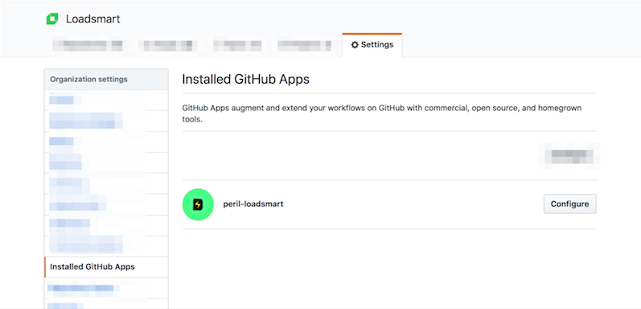
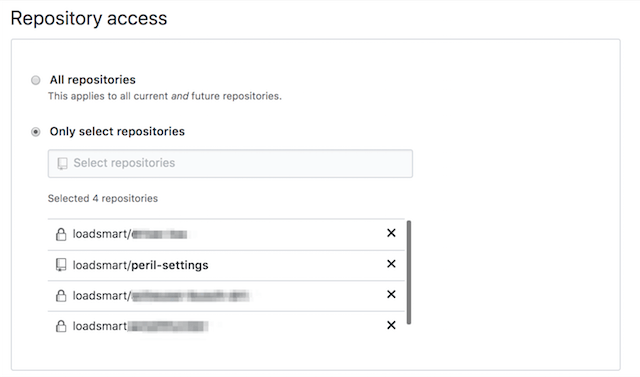

[](https://circleci.com/gh/loadsmart/peril-settings)

# Peril Settings

🔧 Settings for Loadsmart's hosted Danger instance

## How to add Peril to my repo

**Note**: this applies to repositories under Loadsmart organization. If
you want to install peril for your repositories, you probably want to
take a look at the general instructions available at
[peril repository][peril-repo].

For Loadsmart organization, the app is already instaled and configured.
You'll only need to enable it for your repository.

Go to [org settings][org-settings], and then select _Installed Github
Apps_.

Choose the one named `peril-loadsmart`:



On the configuration screen for peril-loadsmart app, under _Repository
Access_ section, choose the repository you want Peril to run and then
click _Save_:



## Install

```bash
$ git clone git@github.com:loadsmart/peril-settings.git
$ cd peril-settings
$ brew intall yarn
$ yarn install
```

## Test

```bash
$ yarn jest
```

[org-settings]: https://github.com/organizations/loadsmart/settings/profile
[preil-repo]: https://github.com/danger/peril
